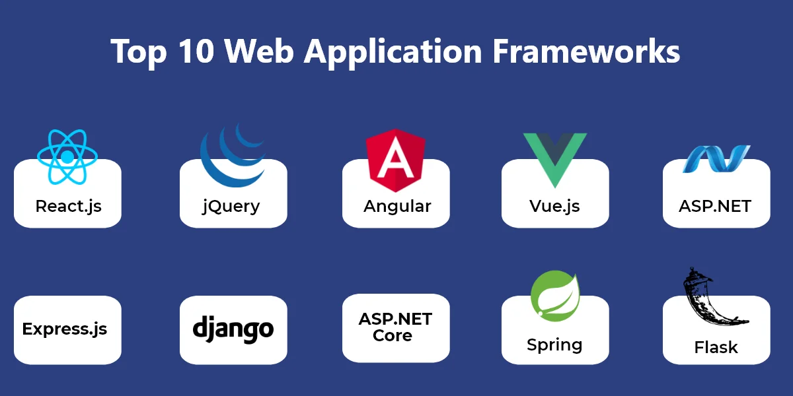

# Вступ до веб-розробки і основи JavaScript

## Вступ до веб-розробки

**Веб-розробка** - це процес створення веб-сайтів чи веб-додатків, доступних через Інтернет. Це різновид програмування, який охоплює розробку клієнтської (frontend) та серверної (backend) частин веб-застосунків. 


### Ключові аспекти та терміни, що важливі для розуміння вступу до веб-розробки:

- **HTML (Hypertext Markup Language)**: HTML є основною мовою розмітки для створення веб-сторінок. Вона визначає структуру документа та включає елементи, такі як заголовки, абзаци, зображення та посилання.
- **CSS (Cascading Style Sheets)**: CSS використовується для стилізації HTML-документів, надаючи їм вигляд і форматування. За допомогою CSS можна визначити кольори, розміри шрифтів, відступи та інші аспекти зовнішнього вигляду.
- **JavaScript**: Це мова програмування, яка використовується для створення динамічних та інтерактивних елементів веб-сторінок. JavaScript дозволяє вам взаємодіяти з користувачем, маніпулювати DOM (Document Object Model) та виконувати асинхронні запити до сервера.
- **Frontend (Клієнтська частина)**: Frontend розробка включає в себе створення користувацького інтерфейсу, який взаємодіє з користувачем. Вона охоплює HTML, CSS та JavaScript і відповідає за те, як веб-сайт виглядає та як відбувається взаємодія з користувачем.
- **Backend (Серверна частина)**: Backend розробка стосується роботи сервера та бази даних. Вона відповідає за обробку запитів від клієнтів, виконання логіки бізнес-процесів, і збереження та отримання даних з бази даних.
- **HTTP (Hypertext Transfer Protocol)**: HTTP - це протокол передачі даних, який використовується для комунікації між веб-клієнтом та сервером. Він визначає, як запити та відповіді повинні бути структуровані та передаватися.

- **Web Frameworks**: Фреймворки для веб-розробки, такі як Django для Python, Express для JavaScript (Node.js), або Ruby on Rails, допомагають спростити процес розробки, надаючи готові рішення та структуру проекту.



## JavaScript

::: tip Нотатка
- JavaScript є найпопулярнішою мовою програмування у світі. 
- JavaScript було створено для того, щоб “оживити вебсторінки”
:::
Програми цією мовою називаються **скриптами**. Їх можна писати прямо на сторінці в коді HTML і вони автоматично виконуватимуться при завантаженні сторінки. Скрипти записуються та виконуються як простий текст. Для запуску їм не потрібна спеціальна підготовка чи компілятор.

Сьогодні JavaScript може виконуватися не тільки в браузері, але й на сервері або на будь-якому пристрої, який має спеціальну програму — **рушій JavaScript**.

::: tip ⭐️ Як рушії працюють?
Рушії складні. Але принцип роботи простий.

1. *Рушій (вбудований, якщо це браузер) читає (“розбирає”) скрипт.*
2. *Потім він перетворює (“компілює”) скрипт у машинний код.*
3. *Після чого цей машинний код виконується, причому досить швидко.*

Рушій застосовує оптимізації на кожному етапі процесу. Він навіть слідкує за скомпільованим скриптом під час його виконання, аналізуючи дані, що проходять через нього, і оптимізує машинний код, зважаючи на ці знання.
:::


### Що може вбудований у браузер JavaScript?

Сучасний JavaScript – це “безпечна” мова програмування. Вона не надає низькорівневого доступу до пам’яті чи процесора, оскільки була створена для браузерів, які цього не потребують.

Можливості JavaScript значно залежать від середовища, у якому виконується скрипт. Наприклад, Node.js підтримує функції, які дозволяють JavaScript читати/записувати довільні файли, здійснювати мережеві запити тощо.

Вбудована в браузер JavaScript може робити все, що пов’язано з управлінням вебсторінками, взаємодією з користувачем та вебсервером.

**Наприклад, JavaScript може:**

* Додавати новий HTML-код на сторінку, змінювати наявний вміст, змінювати стилі.
* Реагувати на дії користувача, опрацьовувати натискання миші, переміщення вказівника, натискання на клавіші клавіатури.
* Надсилати запити мережею до віддалених серверів, викачувати та надсилати файли (так звані технології AJAX і COMET).
* Отримувати і надсилати куки, ставити запитання відвідувачам, показувати повідомлення.
* Запам’ятовувати дані на стороні клієнта (“local storage”), які будуть доступні в майбутніх сесіях на цьому вебсайті.

### Що НЕ може JavaScript?

Можливості JavaScript у браузері обмежені для безпеки користувача. Мета полягає в тому, щоб небезпечні вебсторінки не мали доступу до приватної інформації та не могли пошкодити інформацію на комп’ютері користувача.

**Приклади таких обмежень:**

* **JavaScript на вебсторінці не може читати/записувати довільні файли на жорсткому диску, копіювати їх чи виконувати програми. Скрипт не має прямого доступу до функцій ОС.**
Сучасні браузери дозволяють працювати з файлами, але доступ до них обмежений і надається тільки тоді, коли користувач виконав відповідні дії, наприклад, перетягнув файл у вікно браузера чи вибрав його через теґ `<input>`.
Є шляхи взаємодії з камерою/мікрофоном та іншими пристроями, але для цього потрібен явний дозвіл користувача. Тому сторінка з JavaScript не може нишком увімкнути веб-камеру, спостерігати за оточенням і надсилати інформацію до СБУ.

* **Різні вкладки/вікна зазвичай не знають одне про одного.** Іноді це можливо, наприклад, коли одне вікно використовує JavaScript, щоб відкрити інше. Але навіть у такому випадку JavaScript з однієї сторінки не має доступу до іншої, якщо вони з різних сайтів (мають різні домени, протоколи чи порти).
Це називається “Політикою того ж походження (Same Origin Policy)”. Щоб обійти це обмеження, обидві сторінки мають погодитися на обмін даними та містити спеціальний JavaScript-код, який здійснюватиме це. Ми розглянемо цю тему в посібнику.
Знову-таки, це обмеження існує задля безпеки користувача. Сторінка за адресою `http://anysite.com`, яку відкрив користувач, не повинна мати доступу до іншої вкладки браузера з URL-адресою `http://gmail.com` і викрадати звідти інформацію.

* **JavaScript може легко спілкуватися мережею з сервером,** від якого отримана поточна сторінка. Але здатність скрипта отримувати дані з інших сайтів/доменів обмежена. Такі запити можливі, але потребують спеціальної згоди (вираженої в HTTP-заголовках) від віддаленого сервера. Це також зроблено з метою безпеки.


Таких обмежень немає, якщо JavaScript використовується за межами браузера, наприклад, на сервері. Сучасні браузери дозволяють установлювати плаґіни/розширення, які мають розширені можливості, проте вимагають розширених прав.

### Специфікація

[Специфікація ECMA-262](https://ecma-international.org/publications-and-standards/standards/ecma-262/) містить найглибшу, найдетальнішу й найбільш формалізовану інформацію про JavaScript. Фактично, ця специфікація визначає мову.

Але саме через формалізований стиль її важко зрозуміти з першого разу. Тому, якщо вам потрібне найнадійніше джерело інформації про деталі мови, специфікація – правильне місце. Однак, це джерело не для повсякденного використання.

Щороку випускається нова версія специфікації. Між цими випусками, остання “чернетка” доступна на сайті https://tc39.es/ecma262/.

Щоб прочитати про найновіші функції, включно з тими, які “майже входять в стандарт” (так звана “стадія 3”), перегляньте пропозиції на https://github.com/tc39/proposals.

### Довідники

**MDN (Mozilla) JavaScript Reference** – це головний довідник з прикладами та іншою інформацією. Він чудово підходить для детального вивчення окремих функцій, методів тощо.

Його можна знайти за цим посиланням https://developer.mozilla.org/en-US/docs/Web/JavaScript/Reference.

Хоча, замість пошуку на сайті, краще використовувати пошукові системи. Просто напишіть `MDN [термін]` в пошуковому запиті. Наприклад, запит https://www.google.com.ua/search?q=MDN+parseInt знайде інформацію про функцію `parseInt`.

### Редактор коду

Є два основні види редакторів коду: IDE і легкі редактори. 
**Visual Studio Code** (багатоплатформний, безкоштовний). `Не плутайте з “Visual Studio”`. 

Посилання для завантаження – https://code.visualstudio.com/ 


### Інструменти розробника

Для прикладів ми будемо використовувати браузер **Google Chrome**. Інструменти розробника в ньому показуються лише англійською мовою, незалежно від налаштувань браузера.

Наприклад, відкриємо сторінку bug.html. На ній є помилка в коді `JavaScript`. Вона прихована для звичайних користувачів, тому потрібно відкрити інструменти розробника, щоб її побачити.

Натисніть клавішу `F12` або, якщо у вас Mac, комбінацію клавіш `Cmd+Opt+J`.

Інструменти розробника типово відкриваються на вкладці `Console`.

Ось так відображається помилка в консолі:


Точний вигляд інструментів розробника може відрізнятися в залежності від вашої версії Chrome. Вони міняються час від часу, але в основному це вікно повинно бути схожим.

* Тут ми можемо побачити червоне повідомлення про помилку. У нашому випадку, скрипт має невизначену команду `lalala`.
* З правого боку є посилання на джерело `bug.html:12` з номером рядка, де ця помилка виникла. При натисканні на це посилання, вас перенаправить на вкладку “Sources” (файли з кодом сторінки), де відкриється файл і перейде на рядок, в якому трапилася помилка.
Нижче повідомлення про помилку є синій символ `>`. Цей символ позначає “командний рядок”, де ми можемо вводити команди JavaScript. Натисніть `Enter`, щоб їх виконати.

::: tip ⭐️ Введення декількох рядків
Зазвичай, коли ми вводимо один рядок коду в консоль і натискаємо `Enter`, він виконується.

Щоб ввести декілька рядків коду, натисніть `Shift+Enter`. Таким чином можна вводити і виконувати довгі фрагменти JavaScript коду.
:::

**Більшість браузерів** використовують клавішу `F12`, щоб відкрити консоль розробника.

Їх вигляд зазвичай схожий. Якщо ви навчитеся використовувати однин з них (можете почати з Chrome), ви зможете легко переключитися на інший браузер.

**Safari** (стандартний браузер у macOS, не підтримується Windows/Linux) має свої нюанси. Спочатку нам потрібно увімкнути меню `Розробка`.
Відкрийте `Параметри` і перейдіть на панель `Експертні`. Знизу буде галочка, яку необхідно вибрати:

Тепер комбінація клавіш `Cmd+Opt+C` може переключати консоль. Також зауважте, що з’явився новий пункт `Розробка` у верхньому меню. Це меню має багато команд та опцій.

* Інструменти розробника дозволяють нам переглядати помилки, виконувати команди, досліджувати змінні та багато іншого.
* Їх можна відкрити клавішою `F12` для **більшості браузерів в Windows**. В **Chrome для Mac** потрібно натиснути комбінацію клавіш `Cmd+Opt+J`, в **Safari**: `Cmd+Opt+C` (але спочатку інструменти потрібно увімкнути).

Тепер у нас є готове середовище. В наступному розділі ми приступимо до самого JavaScript.

## Основи JavaScript

### Підключення скриптів JavaScript до сторінок
Є два варіанти, як можна підключити ці скрипти до HTML сторінок.

#### 1. Тег `<script>` можна вставити у будь-яку частину HTML документа

```html{6-8}
<!DOCTYPE HTML>
<html>
    <head>...</head>
    <body>
        <p>Текст перед скриптом...</p>
        <script> // [!code focus]
            alert( 'Привіт, світ!' ); // [!code focus]
        </script> // [!code focus]
        <p>...Після скрипта.</p>
    </body>
</html>
```

#### 2. Зовнішні скрипти

Найкраща практика – це використання саме зовнішніх скриптів. Крім того, ящо ми маємо багато коду на JavaScript, це дає змогу розділити його на окремі файли, що покращує зручність роботи. 
Файл скрипта можна додати до HTML за допомогою атрибута `src`:

```html
<script src="/path/to/script.js"></script>
```

Тут `/path/to/script.js` — абсолютний шлях до файлу скрипта з кореня сайту. Також можна вказати відносний шлях з поточної сторінки. Наприклад, `src="script.js"`, так само як `src="./script.js"`, означатиме, що файл `script.js` у поточній директорії.

Ми також можемо вказати `повну URL-адресу`. Наприклад:
```html
<script src="https://cdnjs.cloudflare.com/ajax/libs/lodash.js/4.17.11/lodash.js"></script>
```

Щоб додати кілька скриптів, використовуйте кілька тегів:

```html
<script src="/js/script1.js"></script>
<script src="/js/script2.js"></script>
…
```

### Інструкції

**Інструкції** – це синтаксичні конструкції та команди, які виконують дії.
```js 
alert('Привіт, світ!')
```
Можна писати стільки інструкцій, скільки завгодно. Інструкції можна розділяти крапкою з комою.

Наприклад, тут ми розділити “Привіт, світ” на два виклики alert:

```js
alert('Привіт');
alert('Світ');
```
### Крапка з комою

Здебільшого крапку з комою можна пропустити, якщо є перенесення на новий рядок. 

Такий код буде працювати:
```js
alert('Привіт');
alert('Світ');
```

У цьому разі JavaScript інтерпретує перенесення рядка як “неявну” крапку з комою. Це називається автоматичне вставлення крапки з комою.

**Переважно новий рядок означає крапку з комою. Але “переважно” не означає “завжди”!**

У деяких випадках новий рядок не означає крапку з комою. Наприклад:

```js
alert(3 +
1
+ 2);
```

Код виведе 6, тому що JavaScript не вставить тут крапку з комою. Інтуїтивно зрозуміло, що, якщо рядок закінчується плюсом "+", то це “незакінчений вираз”, тому крапка з комою не потрібна. І в цьому випадку все працює як задумано.

**Але є ситуації, коли JavaScript “забуває” вставити крапку з комою там, де це дійсно потрібно.**

Помилки, які виникають у таких ситуаціях, досить важко виявити й виправити.

::: tip ⭐️ Приклад такої помилки
Якщо хочете побачити конкретний приклад такої помилки, зверніть увагу на цей код:
```js
alert("Привіт");

[1, 2].forEach(alert);
```
Поки що не задумуйтеся, що означають квадратні дужки `[]` і `forEach`. Ми вивчимо їх пізніше. Зараз просто запам’ятайте результат виконання коду: спочатку виведеться `Привіт`, далі `1`, а потім `2`.

А тепер видалимо крапку з комою після першого `alert`:
```js
alert("Привіт")

[1, 2].forEach(alert)
```

Різниця з кодом вище лише в одному символі: крапка з комою, яку ми видалити в кінці першого рядка.

Якщо ми запустимо цей код, виведеться лише `Привіт` (а потім виникне помилка, яку можна побачити в консолі). Числа більше не виводяться.

Це тому що JavaScript не вставляє крапку з комою перед квадратними дужками `[...]`. Оскільки крапка з комою автоматично не вставиться, код у цьому прикладі виконається як одна інструкція.

Ось як рушій побачить її:
```js
alert("Привіт")[1, 2].forEach(alert);
```
Виглядає дивно, чи не так? У цьому випадку таке об’єднання неправильне. Щоби код правильно працював, нам потрібно поставити крапку з комою після `alert`.

Це може статися в інших випадках.

:::


**Рекомендація** – ставити крапку з комою між інструкціями, навіть якщо вони розділені новими рядками. Це правило широко використовується в спільноті розробників. Варто повторити ще раз – здебільшого можна пропускати крапки з комою. Але безпечніше – особливо для новачка – використовувати їх.

### Коментарі

Коментарі можна писати в будь-якому місці скрипту. Вони не впливають на його виконання, тому що рушій просто ігнорує коментарі.

**Однорядкові коментарі починаються з подвійної косої риски `//`.** Частина рядка після `//` вважається коментарем. Такий коментар може займати весь рядок, або міститися після інструкції.

**Багаторядкові коментарі починаються з косої риски з зірочкою /* і закінчується зірочкою з косою рискою `*/`.** Вміст коментаря ігнорується, тому, якщо ми напишемо всередині `/* … */` код, він не виконається.

```js
// Цей коментар займає весь рядок
alert('Привіт');
alert('Світ'); // Цей коментар міститься після інструкції


/* Приклад із двома повідомленнями.
Це багаторядковий коментар.
*/
alert('Привіт');
alert('Світ');


/* Закоментований код
alert('Привіт');
*/
alert('Світ');
```

::: danger
Вкладені коментарі не підтримуються!

Не може бути `/*...*/` всередині `/*...*/`.

Такий код “помре” з помилкою:

```js
/*
  /* вкладений коментар ?!? */
*/
alert( 'Світ' );
```
:::

### Змінні

Змінна це “іменована частинка сховища”, в якій зберігаються дані. Ми можемо використовувати змінні, щоб зберігати товари, відвідувачів та інші дані.

Щоб створити змінну, використовуйте ключове слово `let`.

```js
let message;
message = 'Привіт'; // збереження рядка 'Привіт' у змінній `message`
alert(message); // показує вміст змінної


let message = 'Привіт!'; // оголошення змінної і присвоєння значення
alert(message); // Привіт!


let user = 'Іван', age = 25, message = 'Привіт';

let user = 'Іван';
let age = 25;
let message = 'Привіт';

// Деякі люди також оголошують змінні в такому багаторядковому стилі:
let user = 'Іван',
    age = 25,
    message = 'Привіт';
```

Оголошення змінної вдруге призведе до помилки
```js
let message = "Це";

// повторне 'let' призведе до синтаксичної помилки
let message = "Той"; // SyntaxError: 'message' has already been declared
```
Тому ми маємо оголосити змінну лише раз, а потім просто посилатися на неї, без ```let```.

::: warning `var` замість `let`
У старих скриптах ви можете знайти інше ключове слово: `var` замість `let`:
```js
var message = 'Привіт';
```
Ключове слово `var` майже таке, як `let`. Воно теж оголошує змінну, але дещо іншим, “застарілим” способом. Є деякі відмінності між `let` і `var`.

::: details ⭐️ Застаріле ключове слово "var"
Оголошення за допомогою `var` подібне до `let`. У більшості випадків ми можемо замінити `let` на `var` або навпаки і очікувати, що це буде працювати:
```js
var message = "Привіт";
alert(message); // Привіт
```
Але `var` – це зовсім інший звір, який походить з дуже давніх часів. Зазвичай він не використовується в сучасних скриптах, але все ще може переховуватися у старих.

**Змінні, оголошені за допомогою `var`, мають або функціональну, або глобальну область видимості. Вони видимі за межами блоку.**

```js
if (true) {
  var test = true; // використовуємо "var" замість "let"
}

alert(test); // true, змінна існує поза блоком if
```
Так як `var` ігнорує блоки, ми отримали глобальну змінну test.

Якщо б ми використали `let test` замість `var test`, тоді змінна була б видима тільки всередині if:
```js
if (true) {
  let test = true; // використовуємо "let"
}

alert(test); // ReferenceError: test не визначена
```
Те саме і для циклів: змінна, оголошена за допомогою `var`, не може бути блочною або локальною всередині цикла:
```js
for (var i = 0; i < 10; i++) {
  var one = 1;
  // ...
}

alert(i);   // 10, "i" видима за межами циклу, це глобальна змінна
alert(one); // 1, "one" видима за межами циклу, це глобальна змінна
```
Якщо блок коду знаходиться всередині функції, тоді `var` стає змінною рівня функції:
```js
function sayHi() {
  if (true) {
    var phrase = "Привіт";
  }

  alert(phrase); // спрацьовує
}

sayHi();
alert(phrase); // ReferenceError: phrase не визначена
```
Як ми бачимо, `var` виходить за межі `if`, `for` або інших блоків коду. Так відбувається тому, що колись блоки у Javascript не мали лексичного середовища, тому `var` – це пережиток минулого.

**`var` терпить повторні оголошення**
Якщо ми оголосимо одну і ту ж змінну за допомогою let двічі в одній області видимості, матимемо помилку:
```js
let user;
let user; // SyntaxError: 'user' вже оголошена
```
З `var`, ми можемо повторно оголошувати змінну безліч разів. Якщо ми використовуємо `var` із вже оголошенною змінною, воно просто ігнорується:
```js
var user = "Петро";

var user = "Іван"; // цей "var" нічого не робить (змінна вже оголошена). Зміниться лише значення
// ...помилки не виникне

alert(user); // Іван
```

**Змінні `var` можуть бути оголошені після їх використання**
<!-- https://uk.javascript.info/var -->
:::

#### Іменування змінних
В JavaScript є два обмеження, які стосуються імен змінних:

1. Ім’я має містити лише букви, цифри або символи ```$``` і ```_```.
2. Перший символ не має бути числом.

Ось приклади допустимих імен:
```js
let userName;
let test123;
```
Для написання імені, яке містить декілька слів, зазвичай використовують “верблюжий регістр” (camelCase). Тобто слова йдуть одне за одним, і кожне слово пишуть із великої букви й без пробілів: ```myVeryLongName```. Зауважте, що перше слово пишеться з маленької букви.

Приклади недопустимих імен змінних:

```js
let 1a; // не може починатися з цифри

let my-name; // дефіс '-' недопустимий в імені
```

::: danger Увага!
**1. Регістр має значення!**

Змінні з іменами ```apple``` і ```APPLE``` – це дві різні змінні.

**2. Нелатинські букви дозволені, але не рекомендуються**

Можна використовувати будь-яку мову, включно з кирилицею або навіть ієрогліфами, наприклад:
```js
let назва = '...';
let 我 = '...';
```

Технічно тут немає помилки. Такі імена дозволені, проте є міжнародна традиція використовувати англійську мову в іменах змінних (наприклад, ```yaLyublyuUkrainu => iLoveUkraine```). Навіть якщо ми пишемо маленький скрипт, у нього може бути тривале життя попереду. Можливо, людям з інших країн колись доведеться прочитати його.

**3. Зарезервовані слова**

Є список зарезервованих слів, які не можна використовувати як імена змінних, тому що ці слова використовує сама мова.

Наприклад: ```let```, ```class```, ```return``` і ```function``` зарезервовані.